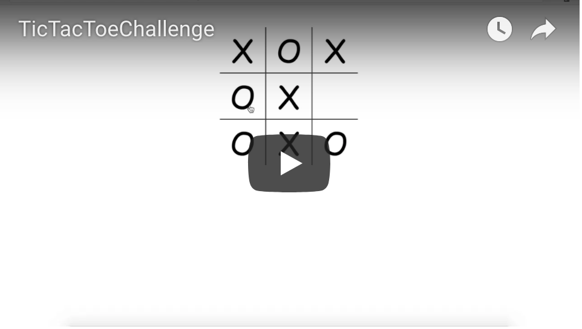

# Tic-Tac-Toe-Challenge

Simple Tic Tac Toe game using VueJS/HTML/CSS.

** How to start the game: **

Download a file from github and open "index.html" by browser.

You can see a preview of this app in action in the following video preview:

https://youtu.be/XRGU5-aucao

**About the project**

- Design a tic-tac-toe board using HTML, CSS, and VueJS web components.

- As a user, I should be able to click an empty space on the board that turns into an 'X'

- After an 'X' is placed, clicking on an empty space should place an 'O' and continue to alternate between 'X' and 'O'.

** Bonus: **

- If 3 X's or O's are in a row vertically or diagonally, a toastr message will pop up letting player 1 (x's) or player 2 (o's) know they won.

Resources:
https://vuejs.org/v2/guide/

**Future enhancements**
- Color "X" with blue and "O" with red
- Show a message who is in turn
- Add reset/restart button
- Add score board
